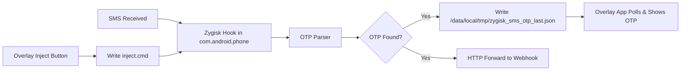

# Zygisk SMS OTP Hook Module

Apna khud ka Zygisk module jo **SMS hook**, **auto OTP read**, aur **auto token forward** karta hai — screenshot jaisa floating mod menu ke saath.

> **Important:** Sirf apne device par, legal aur ethical use ke liye. Doosron ke OTP intercept karna illegal hai.

## Features

| Feature | Description |
|---------|-------------|
| Hook Incoming SMS | Aane wale SMS intercept karke OTP extract karta hai |
| Hook Outgoing SMS | Jaane wale SMS monitor karta hai |
| Auto OTP Extract | Regex patterns se 4–8 digit OTP nikalta hai |
| Auto Token Forward | Webhook/Telegram/server par OTP JSON format mein bhejta hai |
| Inject Local SMS | Test ke liye local SMS inject karta hai (Sender ID + Body) |
| Overlay Mod Menu | Screenshot jaisa dark floating UI |

## Project Structure

```
Zygisk-module/
├── module/                  # Magisk + Zygisk native module
│   ├── module.prop
│   ├── customize.sh
│   ├── service.sh
│   ├── config.json
│   └── jni/                 # C++ Zygisk hooks
├── overlay-app/             # Android floating menu APK
├── build.sh                 # Native module build script
└── build-app.sh             # Overlay APK build script
```

## Requirements

- Rooted Android device with **Magisk 26+** and **Zygisk enabled**
- Android NDK (r26+)
- Android SDK (overlay app ke liye)
- CMake 3.22+

## Installation

### Step 1: Native Module Build

```bash
export ANDROID_NDK=$HOME/Android/Sdk/ndk/26.1.10909125
chmod +x build.sh
./build.sh
```

Output: `zygisk_sms_otp-v1.0.0.zip`

### Step 2: Magisk mein Flash

1. Magisk Manager → Modules → Install from storage
2. `zygisk_sms_otp-v1.0.0.zip` select karein
3. Reboot karein

### Step 3: Overlay App Install

Android Studio se `overlay-app/` open karein ya:

```bash
export ANDROID_HOME=$HOME/Android/Sdk
chmod +x build-app.sh
./build-app.sh
```

APK install karein aur **Display over other apps** permission dein.

## Configuration

Config file: `/data/adb/modules/zygisk_sms_otp/config.json`

```json
{
  "hook_incoming_sms": true,
  "hook_outgoing_sms": true,
  "auto_extract_otp": true,
  "auto_forward_token": true,
  "forward_url": "https://your-server.com/otp",
  "forward_method": "POST",
  "forward_headers": {
    "Content-Type": "application/json",
    "Authorization": "Bearer YOUR_TOKEN"
  },
  "otp_patterns": [
    "\\b(\\d{4,8})\\b.*(?:otp|code|verification|verify|pin)",
    "(?:otp|code|verification|verify|pin)[:\\s]*(\\d{4,8})"
  ],
  "inject_sender_id": "AD-TEST-S",
  "log_file": "/data/local/tmp/zygisk_sms_otp.log"
}
```

Overlay app se bhi config update hoti hai — runtime file: `/data/local/tmp/zygisk_sms_otp_config.json`

## Overlay Menu Usage

1. App open karein → **Start Overlay Menu**
2. **MESSAGE** tab:
   - Hook Incoming/Outgoing SMS toggles
   - Sender ID set karein (e.g. `AD-TEST-S`)
   - Message body likhein (e.g. `Your verification OTP code is 918204`)
   - **Inject Local SMS** dabayein
3. **FORWARD** tab:
   - Webhook URL set karein
   - Auto Forward Token ON karein
4. **SYSTEM** tab:
   - Last captured OTP dikhega

## Token Forward Format

Webhook par POST body:

```json
{
  "otp": "918204",
  "sender": "AD-TEST-S",
  "body": "Your verification OTP code is 918204",
  "pattern": "matched_regex_pattern"
}
```

## How It Works



Zygisk module `com.android.phone` aur `com.android.providers.telephony` processes mein load hota hai aur SMS pipeline hook karta hai.

## Logs

```bash
adb shell cat /data/local/tmp/zygisk_sms_otp.log
adb logcat -s ZygiskSmsOtp SmsHook Forwarder InjectSms
```

## Telegram Bot Forward (Example)

Apne server par webhook banao ya directly Telegram Bot API use karo:

```
forward_url: https://api.telegram.org/bot<BOT_TOKEN>/sendMessage
```

Server-side script message format karega.

## Troubleshooting

| Problem | Solution |
|---------|----------|
| Module load nahi ho raha | Magisk → Zygisk ON karein, reboot |
| OTP capture nahi ho raha | `hook_incoming_sms: true` check karein, log dekhein |
| Forward fail | HTTP URL use karein (HTTPS native layer mein limited hai — overlay app HTTPS support karti hai) |
| Overlay nahi dikh raha | Display over other apps permission dein |

## Legal Notice

Yeh tool sirf **personal automation**, **security research**, aur **apne apps test** karne ke liye hai. Bina consent ke doosron ke SMS/OTP intercept karna kanoon ke khilaaf hai.

## License

MIT — apne risk par use karein.
